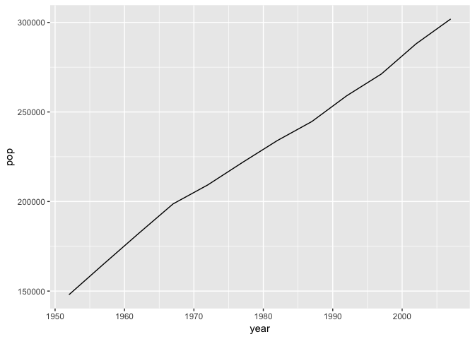
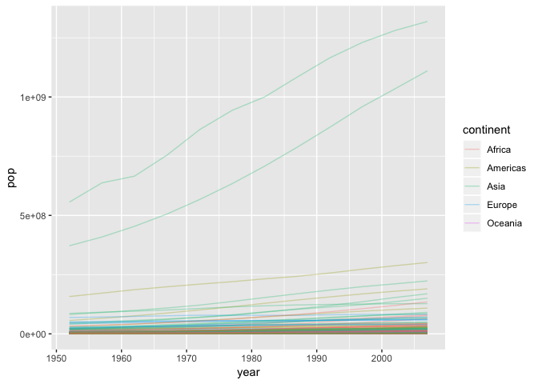
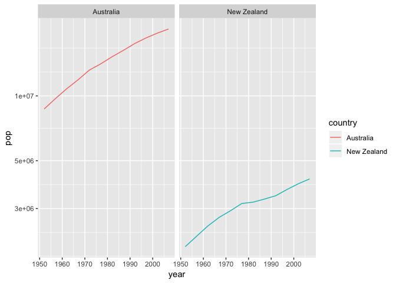
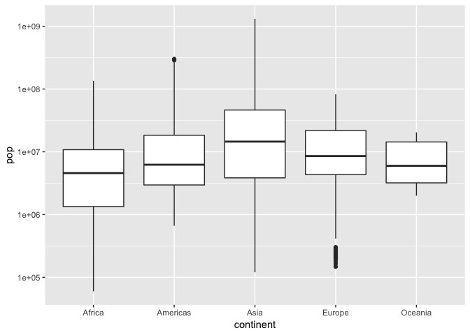
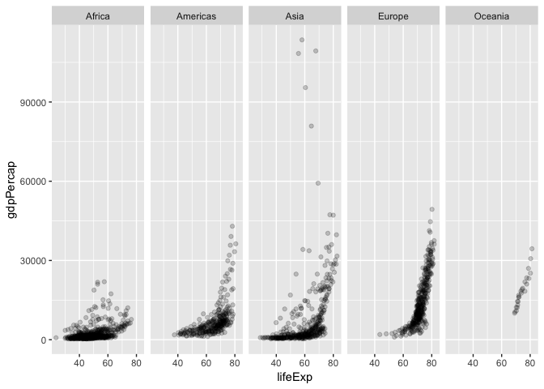
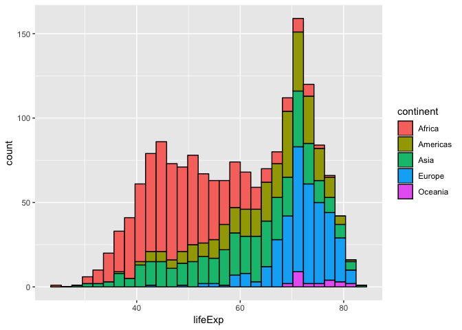

Homework 2: Exploring a dataframe
================

## Load `gapminder` and `tidyverse` packages.

First things first. Before we can start the analysis we have to install
and load the necessary dataset and metapackage. We can install a package
typing `install.packages("package_name")` in the console and afterwards
load these as follows:

``` r
library(gapminder)
library(tidyverse)
```

    ## ── Attaching packages ────────────────────────────────────────────────────────── tidyverse 1.2.1 ──

    ## ✔ ggplot2 3.0.0     ✔ purrr   0.2.5
    ## ✔ tibble  1.4.2     ✔ dplyr   0.7.6
    ## ✔ tidyr   0.8.1     ✔ stringr 1.3.1
    ## ✔ readr   1.1.1     ✔ forcats 0.3.0

    ## ── Conflicts ───────────────────────────────────────────────────────────── tidyverse_conflicts() ──
    ## ✖ dplyr::filter() masks stats::filter()
    ## ✖ dplyr::lag()    masks stats::lag()

## Exploring the `gapminder` object

Our workflow best starts with exploring the `gapminder` object.
According to the description on CRAN, `gapminder` provides values for
life expectancy, GDP per capita and population, every five years, from
1952 to 2007. The `str()` function will give us an overview of what
`gapminder` contains
    exactely:

``` r
str(gapminder)
```

    ## Classes 'tbl_df', 'tbl' and 'data.frame':    1704 obs. of  6 variables:
    ##  $ country  : Factor w/ 142 levels "Afghanistan",..: 1 1 1 1 1 1 1 1 1 1 ...
    ##  $ continent: Factor w/ 5 levels "Africa","Americas",..: 3 3 3 3 3 3 3 3 3 3 ...
    ##  $ year     : int  1952 1957 1962 1967 1972 1977 1982 1987 1992 1997 ...
    ##  $ lifeExp  : num  28.8 30.3 32 34 36.1 ...
    ##  $ pop      : int  8425333 9240934 10267083 11537966 13079460 14880372 12881816 13867957 16317921 22227415 ...
    ##  $ gdpPercap: num  779 821 853 836 740 ...

We can now see a valuable summary of the structure of the dataset. For
example it is easy to detect that `gapminder` contains `6 variables`,
namely `country`, `continent`, `year`, `lifeExp`, `pop`, and `gdpPercap`
amongst other information.

In general there are different functions we can use to look at certain
aspects of `gapminder` in more detail. Let’s explore some of these next
while asnwerign a couple of questions.

### What is `gapminder`, a `data.frame`, a `matrix`, a `list`?

Let’s check with the `typeof()` functionality:

``` r
typeof(gapminder)
```

    ## [1] "list"

`gapminder` is a `list` according to the return of the `typeof()`
function.

### What is its class?

I can check the class of `gapminder` by calling:

``` r
class(gapminder)
```

    ## [1] "tbl_df"     "tbl"        "data.frame"

We can see that `gapminder`’s class is a `tbl_df`, a `tbl` and a
`data.frame`.

### How many variables/columns and rows/observations?

To inspect the number of variables/columns present in our dataset, we
can call the function `ncol()`. Respectively, we can call `nrows()` to
inspect rows/observations.

``` r
ncol(gapminder)
```

    ## [1] 6

The `gapminder` dataset has `6` variables/columns according to our
function call which is in accordance with our summary generated by using
`str()`.

``` r
nrow(gapminder)
```

    ## [1] 1704

The `gapminder` dataset has `1704` rows/observations which can also be
seen in our summary generated by using
`str()`.

### How can I explore the “extent” or “size” of a dataset in a different way?

Can we get these facts about “extent” or “size” in more than one way?
Yes we definitely can and this is very useful depending on the dataset
or data we want to analyse.

We can not only work with one or two dimensional data or vectors, but
often encounter n-dimensional arrays, which have more than 2 dimensions
(rows, columns). In order to check the “extent” or “size” of
multi-dimensional data we best use `dim()`:

``` r
dim(gapminder) 
```

    ## [1] 1704    6

`dim()` returns the so called dimension of a vector. In our case we see
a format row (1704 rows) by column (6 columns) since our dataset is
2-dimensional. In case a 3rd dimension is present a third number would
have indicated the “size” of the 3rd dimension.

### What data type is each variable?

We already inspected the dtype of each variable by calling
`str(gapminder)`. Let’s explore some other options to check the dtypes.
We could for example use `sapply()`:

``` r
sapply(gapminder, typeof)
```

    ##   country continent      year   lifeExp       pop gdpPercap 
    ## "integer" "integer" "integer"  "double" "integer"  "double"

We can see the variable in the first row and accordingly the type of
each variable in the second row.

We could also simply extract the dtype of each variable separately by
using:

``` r
typeof(gapminder$country)
```

    ## [1] "integer"

This approach however should be best used if we are interested in the
dtype of only a specific variable.

## Exploring individual variables

Next we will explore indivdual variables. We pick one categorical
variable indicated by the type `factor` and one quantitative variable
indicated by the type `numeric` or `integer`. Let’s check the classes of
each variable to find out which ones best to assess:

``` r
sapply(gapminder, class)
```

    ##   country continent      year   lifeExp       pop gdpPercap 
    ##  "factor"  "factor" "integer" "numeric" "integer" "numeric"

Let’s chose these two:

| variable  | type                    |
| --------- | ----------------------- |
| continent | categorical, `factor`   |
| gdpPercap | quantitative, `numeric` |

### What are possible values (or range, whichever is appropriate) of each variable?

There are multiple ways for exploring the values of different variables.
Let’s start by providing a quick overview of the two variables:

``` r
summary(gapminder$continent)
```

    ##   Africa Americas     Asia   Europe  Oceania 
    ##      624      300      396      360       24

``` r
summary(gapminder$gdpPercap)
```

    ##     Min.  1st Qu.   Median     Mean  3rd Qu.     Max. 
    ##    241.2   1202.1   3531.8   7215.3   9325.5 113523.1

Calling this function on a categorical variable shows the count of
occurances for every category or value. In comparison, calling
`summary()` on a quantitative variable calculates for example `Median`
the `Mean` and outlines minimum and maximum
values.

##### To get to know the specific range of a *quantitative* variable we can use the `range()` function:

``` r
range(gapminder$gdpPercap)
```

    ## [1]    241.1659 113523.1329

We now know that values in `gdpPercap` range from roughly 241 to 113523.
Furthermore it is also possible to explicitly ask for the minimum
`min()` and maximum `max()` values with:

``` r
x <- gapminder$gdpPercap
min(x)
```

    ## [1] 241.1659

``` r
max(x)
```

    ## [1] 113523.1

We can see maximum and minimum values of both approaches provide us with
the same
values..

##### In order to explore which categorys or values our “categorical” variables contain we can use the function `unique()`:

``` r
continent <- unique(gapminder$continent)
continent
```

    ## [1] Asia     Europe   Africa   Americas Oceania 
    ## Levels: Africa Americas Asia Europe Oceania

We can see that `unique()` outputs all unique values in our `continent`
variable.

There are also many different ways in R to check how many categories or
different values are present in a variable. We could for example use:

``` r
continent %>% 
  length()
```

    ## [1] 5

``` r
nlevels(gapminder$continent)
```

    ## [1] 5

Both `nlevels()` and `length()` of the unique values return correctly
that there are 5 different continents, they are however not telling us
which continents there
are.

### What values are typical? What’s the spread? What’s the distribution? Etc., tailored to the variable at hand.

Let’s provide a little overview to which values are typical for the
`pop` or population variable:

``` r
population <- gapminder$pop

summary(population)
```

    ##      Min.   1st Qu.    Median      Mean   3rd Qu.      Max. 
    ## 6.001e+04 2.794e+06 7.024e+06 2.960e+07 1.959e+07 1.319e+09

We can see that vaules range from `6.001e+04` at the minimum to
`1.319e+09` at maximum with a median at `7.024e+06`. I am curiouse now
which countries have a population under 1 million for the year 2007,
let’s check:

``` r
gapminder %>% 
  filter((pop < 1000000) & year == 2007) %>% 
  arrange(pop)
```

    ## # A tibble: 8 x 6
    ##   country               continent  year lifeExp    pop gdpPercap
    ##   <fct>                 <fct>     <int>   <dbl>  <int>     <dbl>
    ## 1 Sao Tome and Principe Africa     2007    65.5 199579     1598.
    ## 2 Iceland               Europe     2007    81.8 301931    36181.
    ## 3 Djibouti              Africa     2007    54.8 496374     2082.
    ## 4 Equatorial Guinea     Africa     2007    51.6 551201    12154.
    ## 5 Montenegro            Europe     2007    74.5 684736     9254.
    ## 6 Bahrain               Asia       2007    75.6 708573    29796.
    ## 7 Comoros               Africa     2007    65.2 710960      986.
    ## 8 Reunion               Africa     2007    76.4 798094     7670.

It seems like Sao Tome and Principe and Iceland are the countries with
the smallest population in 2007.

Was Iceland always so unpopulated? How is the population distributed
over different years in Iceland? Let’s check this in a visualization:

``` r
gapminder %>% 
  filter(country == "Iceland") %>% 
  ggplot(aes(year, pop)) +
  geom_line()
```

<!-- -->

Wow it actually seems like Icelands population doubled over the last 55
years.

How does the population growth look like world wide?

``` r
ggplot(gapminder, aes(year, pop)) +
  geom_line(aes(group=country, color=continent), alpha=0.3)
```

<!-- --> It
looks like world wide the population in specifically two countries in
Asia grew the most. Let’s check which two countries these are:

``` r
gapminder %>% 
  arrange(desc(pop)) 
```

    ## # A tibble: 1,704 x 6
    ##    country continent  year lifeExp        pop gdpPercap
    ##    <fct>   <fct>     <int>   <dbl>      <int>     <dbl>
    ##  1 China   Asia       2007    73.0 1318683096     4959.
    ##  2 China   Asia       2002    72.0 1280400000     3119.
    ##  3 China   Asia       1997    70.4 1230075000     2289.
    ##  4 China   Asia       1992    68.7 1164970000     1656.
    ##  5 India   Asia       2007    64.7 1110396331     2452.
    ##  6 China   Asia       1987    67.3 1084035000     1379.
    ##  7 India   Asia       2002    62.9 1034172547     1747.
    ##  8 China   Asia       1982    65.5 1000281000      962.
    ##  9 India   Asia       1997    61.8  959000000     1459.
    ## 10 China   Asia       1977    64.0  943455000      741.
    ## # ... with 1,694 more rows

As expected it seems like India and China take the lead in a growing
population.

## Explore various plot types

We can take this even further and plot the values in `pop` for every
year for all countries on the continent `Oceania` using `facet_grid()`:

``` r
gapminder %>% 
  filter(continent == "Oceania") %>% 
  ggplot(aes(year, pop)) +
    scale_y_log10() +
    geom_line(aes(color=country)) +
    facet_grid(~country)
```

<!-- -->

As we see the population in Australia is significantly higher than in
New Zealand.

How does the population on Oceania compare to the population on other
continents? let’s explore this question with a box plot:

``` r
ggplot(gapminder, aes(continent, pop)) +
 scale_y_log10() +
  geom_boxplot()
```

<!-- -->

We can, for example, see that the population size in Oceania over the
presented 55 years varies less than in other parts of the world, for
example like in Asia.

Let’s explore facet grids an more quantitative variables a little
further. How does `gdpPercap` correlate to `lifeExp` on different
continents?

``` r
ggplot(gapminder, aes(lifeExp, gdpPercap)) +
  geom_point(alpha=0.2) +
  facet_grid(~continent)
```

<!-- -->

We can see that there are relatively high `gdpPercap` values present in
Asia. We also see that life expectancy in Africa was lower over the 55
year timeframe compared to other continents.

Next, let’s see how life expectancy looks like world wide:

``` r
ggplot(gapminder, aes(lifeExp)) + 
  geom_histogram(aes(fill=continent), colour="black")
```

    ## `stat_bin()` using `bins = 30`. Pick better value with `binwidth`.

<!-- -->

This again confirms the notion that life Expectancy is lower in African
countries compared to Europe or North America.
